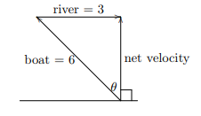

# Vectors

## Section Goals

The more overarching goal of this section is to complete the first goal in the 18.02 syllabus:


Fluency with vector operations, including vector proofs and the ability to translate back and forth among the various ways to describe geometric properties, namely, in pictures, in words, in vector notation, and in coordinate notation.


In gaining fluency with vector operations, this section will introduce a few technical skills:

* Dot product
* Determinant
* Cross product

### Section 1: Basic operations

Vectors can be described geometrically as a thing \(technical term\) that has both a magnitude and a direction. 



a\) A river flows at 3 mph and a rower rows at 6 mph. What heading should the rower take to go straight across a river? b\) Answer the same question if the river flows at 6 mph and the rower rows at 3 mph.




  
We can represent vectors geometrically, as seen in the figure above.

\(a\) If the river has size 3 and the boat size 6, then the angle made by the right triangle between the two \(making a straight path across the river\) is $$ sin^{-1}(3/6) =  sin^{-1}(1/2) =  \frac{\pi}{2}$$ or $$30 \degree$$. 

\(b\) If the boat has size 3 and the river has size 6, then the angle made is $$sin^{-1}(6/3) = sin^{-1}(2)$$which is undefined. Thus, there is no possible straight path for a boat with a speed of 3 across a river with a speed of 6.



